# 🔄 Diagrama de Flujo Completo - INNOVAR Cocinas

## 1. FLUJO GENERAL DE LA APLICACIÓN

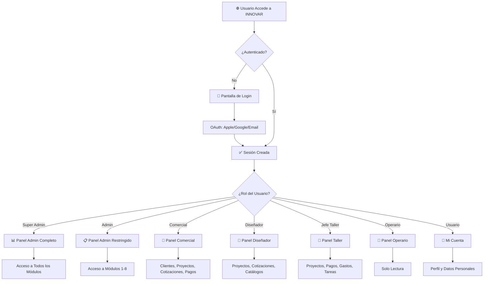

---

## 2. FLUJO DE CLIENTE

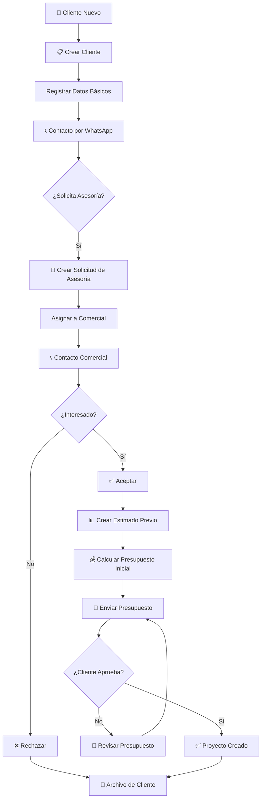

---

## 3. FLUJO DE PROYECTO

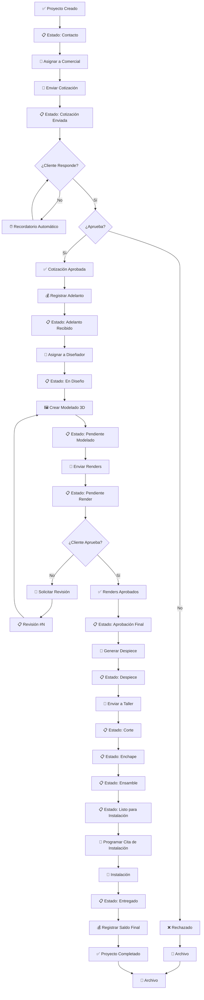

---

## 4. FLUJO DE COTIZACIÓN

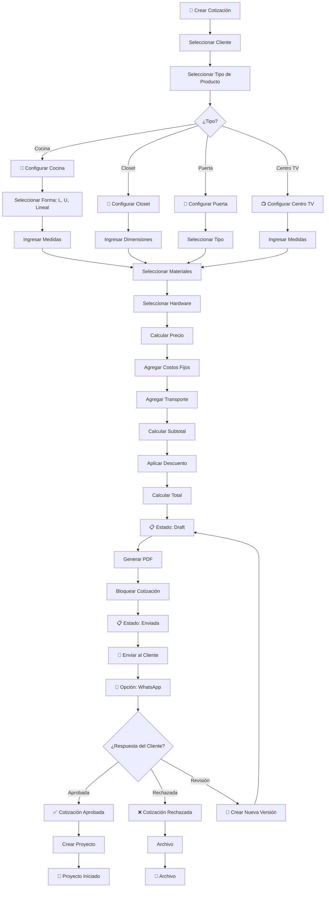

---

## 5. FLUJO DE PAGOS

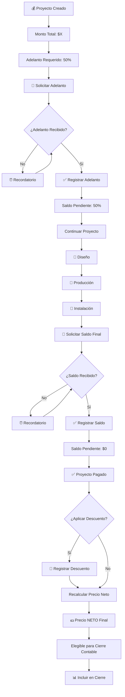

---

## 6. FLUJO DE GASTOS

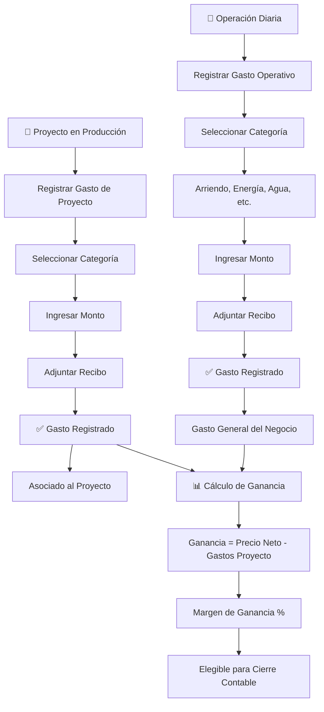

---

## 7. FLUJO DE CIERRE CONTABLE

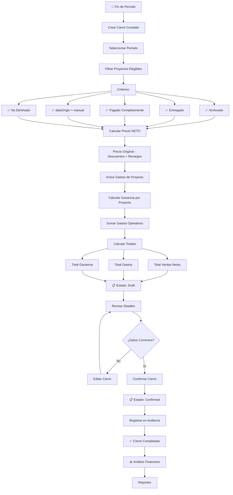

---

## 8. FLUJO DE TAREAS Y RECORDATORIOS

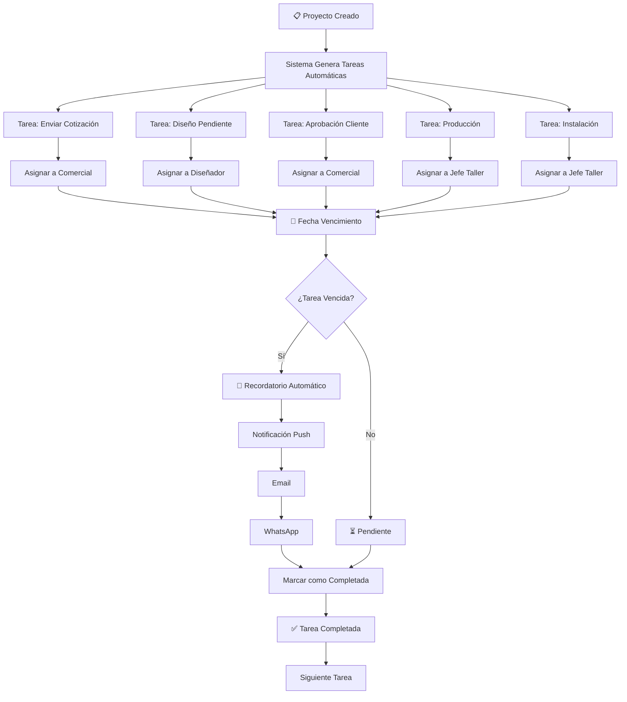

---

## 9. FLUJO DE NOTIFICACIONES

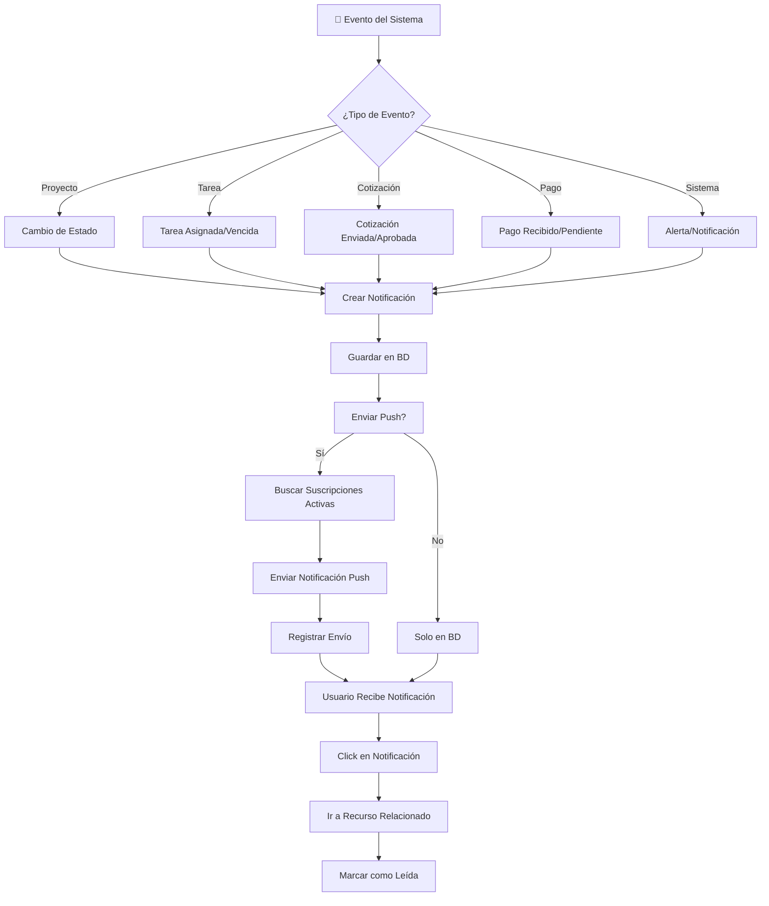

---

## 10. FLUJO DE AUDITORÍA

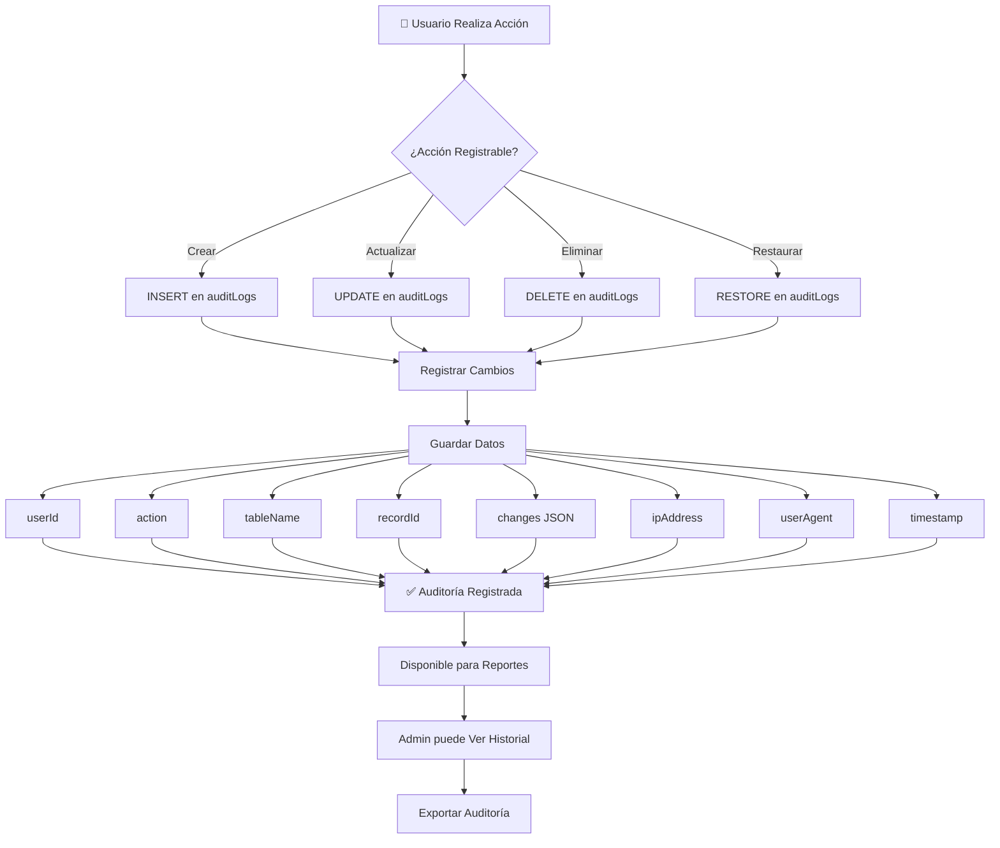

---

## 11. FLUJO DE BACKUPS

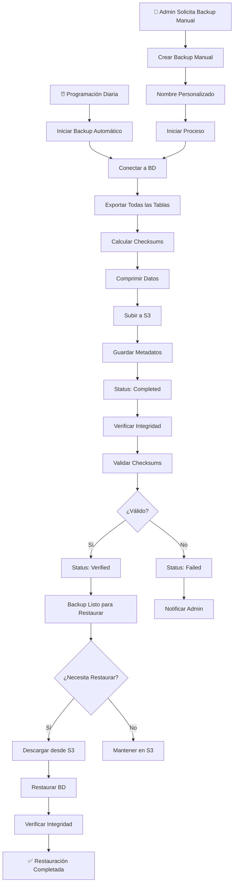

---

## 12. FLUJO DE AUTENTICACIÓN

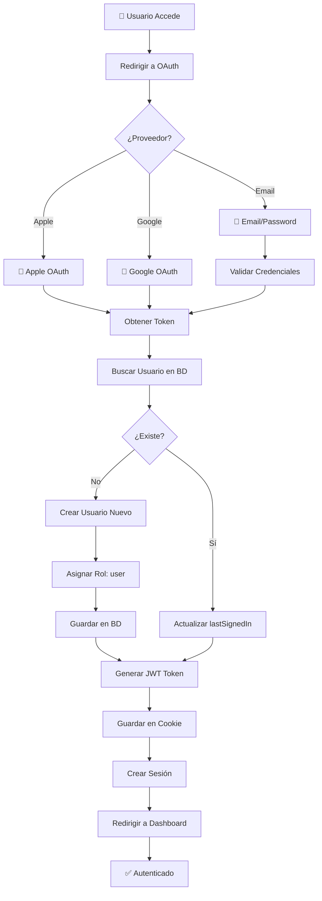

---

## 13. FLUJO DE BÚSQUEDA Y FILTROS

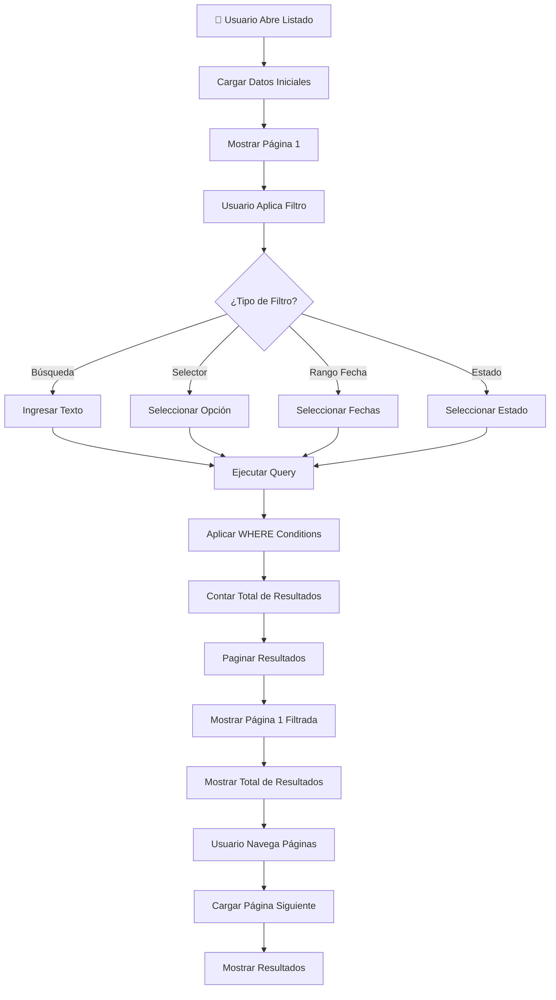

---

## 14. FLUJO DE EXPORTACIÓN

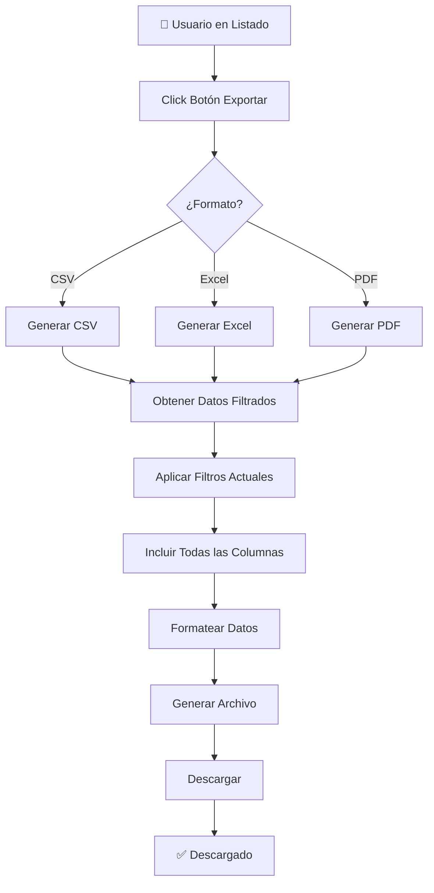

---

## 15. FLUJO DE IMPORTACIÓN

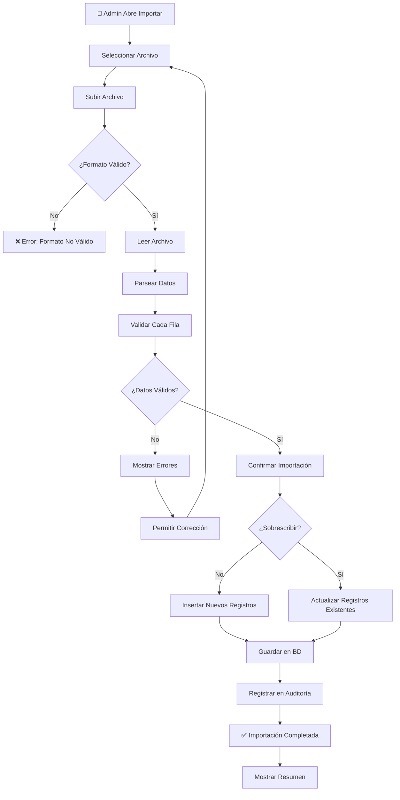

---

## 16. FLUJO DE PERMISOS

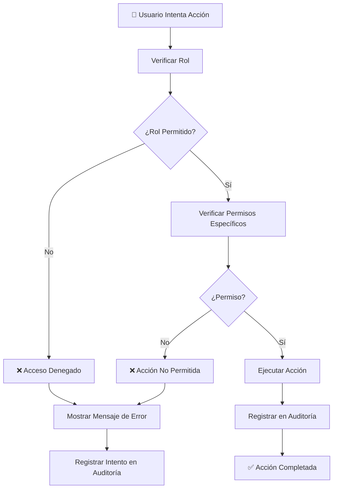

---

## 17. FLUJO DE ERRORES

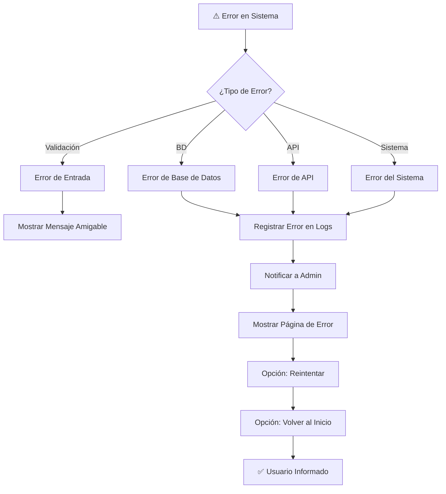

---

## 18. FLUJO DE SINCRONIZACIÓN DE DATOS

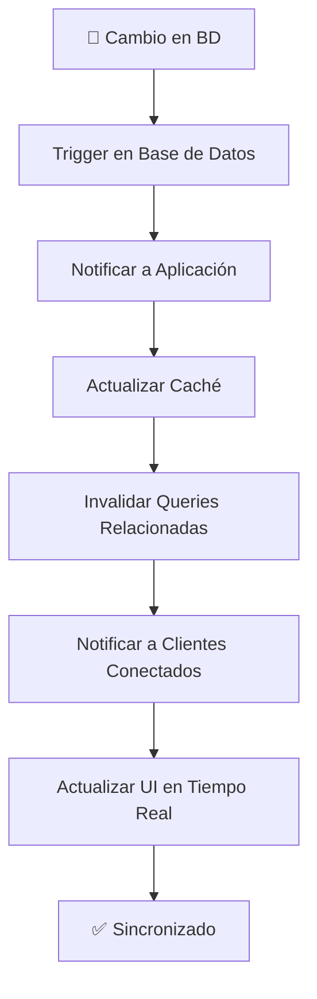

---

## 19. FLUJO DE ALERTAS FINANCIERAS

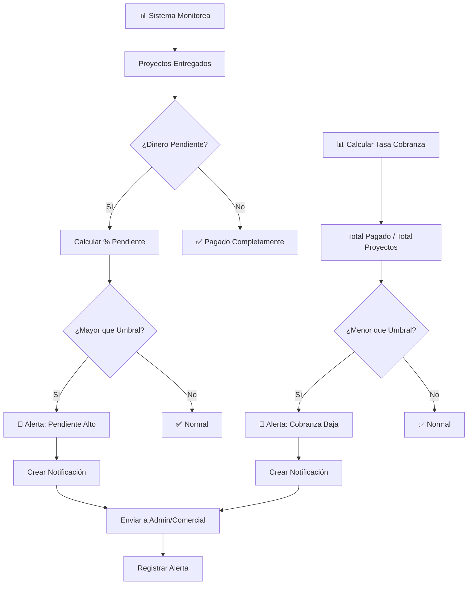

---

## 20. FLUJO GENERAL DE DATOS

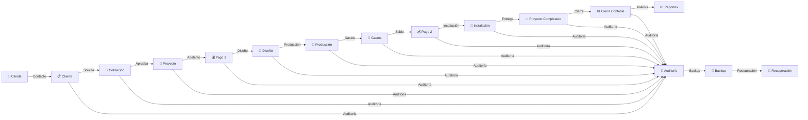

---

# 📊 RESUMEN DE FLUJOS

| Flujo | Inicio | Fin | Pasos | Actores |
|-------|--------|-----|-------|---------|
| 1. General | Login | Dashboard | 7 | Usuario |
| 2. Cliente | Nuevo | Proyecto | 10 | Comercial |
| 3. Proyecto | Creación | Entrega | 15 | Múltiples |
| 4. Cotización | Creación | Aprobación | 20 | Comercial/Cliente |
| 5. Pagos | Adelanto | Cierre | 8 | Comercial/Admin |
| 6. Gastos | Registro | Cierre | 6 | Múltiples |
| 7. Cierre | Creación | Confirmación | 12 | Admin |
| 8. Tareas | Creación | Completación | 8 | Múltiples |
| 9. Notificaciones | Evento | Lectura | 7 | Usuario |
| 10. Auditoría | Acción | Registro | 5 | Sistema |
| 11. Backups | Programación | Verificación | 10 | Sistema |
| 12. Autenticación | Acceso | Sesión | 10 | Usuario |
| 13. Búsqueda | Filtro | Resultados | 6 | Usuario |
| 14. Exportación | Solicitud | Descarga | 7 | Usuario |
| 15. Importación | Archivo | Confirmación | 10 | Admin |
| 16. Permisos | Acción | Ejecución | 6 | Sistema |
| 17. Errores | Excepción | Resolución | 7 | Sistema |
| 18. Sincronización | Cambio | Actualización | 6 | Sistema |
| 19. Alertas | Monitoreo | Notificación | 8 | Sistema |
| 20. Datos | Cliente | Reportes | 12 | Múltiples |

---

## 🎯 PUNTOS CLAVE DEL FLUJO

### 1. **Entrada al Sistema**
- Autenticación OAuth (Apple, Google, Email)
- Asignación automática de rol
- Redirección a dashboard según rol

### 2. **Ciclo de Proyecto**
- Cliente → Cotización → Proyecto → Producción → Instalación → Cierre

### 3. **Flujos Paralelos**
- Diseño, Producción, Pagos ocurren simultáneamente
- Sistema genera tareas automáticas
- Recordatorios automáticos para vencimientos

### 4. **Control Financiero**
- Precio NETO = Original - Descuentos + Recargos
- Gastos asociados a proyectos
- Cierre contable con auditoría completa

### 5. **Seguridad**
- Auditoría de todas las acciones
- Backups automáticos diarios
- Verificación de integridad
- Permisos granulares por rol

### 6. **Notificaciones**
- Push automático
- Email
- WhatsApp
- En-app

### 7. **Reportes**
- Exportación a CSV/Excel/PDF
- Análisis financiero
- Tendencias
- Comparativas

---

**Diagrama Generado**: Abril 2026
**Versión**: 1.0
**Aplicación**: INNOVAR Cocinas Integrales
